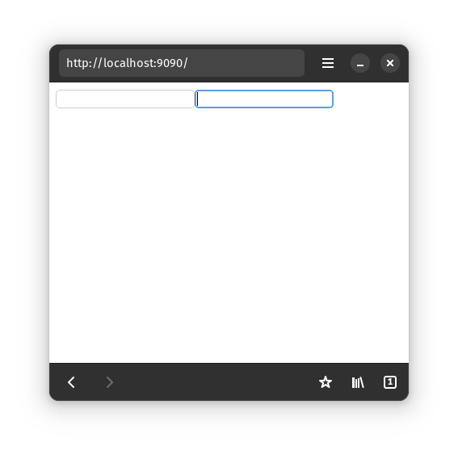

# Making Siblings

We've so far seen how to render HTML elements and nest them.

But how do we put elements side-by-side?

```html
<input />
<input />
```

In the [Building Nested HTML subchapter](./2-nested-html.md), we learned that
UI elements only stay on screen for as long as their corresponding Future
is running. Thus, if we want two elements on the screen at once, we'll
need to run two Futures *concurrently*.

To run Futures concurrently, we "join" them.
The [join function](https://docs.rs/async_ui_web/latest/async_ui_web/fn.join.html)
takes in multiple Futures, and return a single Future. When awaited,
the returned Future will drive the input Futures to completion and return
all their results.

```rust
{{ #include ../../../examples/guide-project/src/building_ui/siblings.rs:two-inputs }}
```


Also, `join` is not limited to tuples of Futures. You can also pass it an array
or a vector of Futures.
See [its documentation](https://docs.rs/async_ui_web/latest/async_ui_web/fn.join.html)
to learn more.

### More complicated example

Let's render this HTML
```html
<div>
	<button>Hello World</button>

	<span>1</span>
	<span>2</span>
	<span>3</span>
	<!-- more spans here -->
	<span>98</span>
	<span>99</span>
	<span>100</span>

	<input />
</div>
```
```rust
{{ #include ../../../examples/guide-project/src/building_ui/components.rs:many-spans }}
```
That code looks pretty complicated ☹️. But we can improve it!
We'll split it into small, easy-to-understand parts in the next subchapter!
