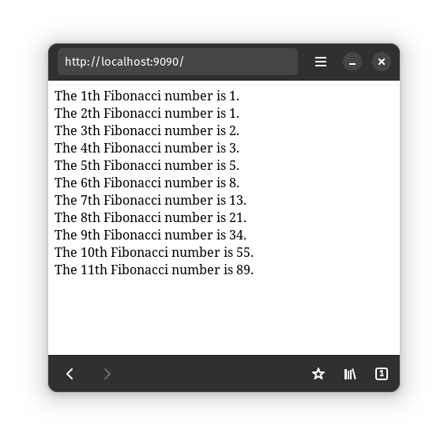

# Lists

We've so far covered how to render many Futures (we rendered 100 `<span>`s [in chapter 1](../building-ui/4-siblings.md)),
and how to dynamically put or remove a Future (the previous subchapter on `DynamicSlot`).

Now, how do we dynamically insert or remove from a list of many Futures?

Async UI comes with many different list components.
They are documented [here](https://docs.rs/async_ui_web/latest/async_ui_web/lists/index.html).

The most recommended list - the one we will use in this guide - is
[ModeledList](https://docs.rs/async_ui_web/latest/async_ui_web/lists/struct.ModeledList.html).

Each ModeledList has two parts:
*	The `ModeledList` instance. This is what you `.render()`.
	It knows how to turn each list item into a Future to be rendered.
*	The data model: [ListModel](https://docs.rs/async_ui_web/latest/async_ui_web/lists/struct.ListModel.html).
	This is where the items of the list actually live. It is similar to a `Vec`.

Operation is simple: you update the `ListModel`,
then tell the `ModeledList` that the data have been updated,
and the `ModeledList` will figure out inserting new items and deleting removed items.

## Example: a Fibonacci list
We'll make a list of Fibonacci numbers.
First, let's import things
```rust
{{ #include ../../../examples/guide-project/src/dynamicity/lists.rs:fibo-imports }}
```

Before making the list, let's think of how we'll render each item in the list
```rust
{{ #include ../../../examples/guide-project/src/dynamicity/lists.rs:fibo-helper }}
```

And finally, we make the list
```rust
{{ #include ../../../examples/guide-project/src/dynamicity/lists.rs:fibo }}
```



**Warning**: Our Fibonacci implementation will eventually overflow.

Fixing the incorrect English usage ("1th", "2th", "3th") is left as an exercise for the reader.
